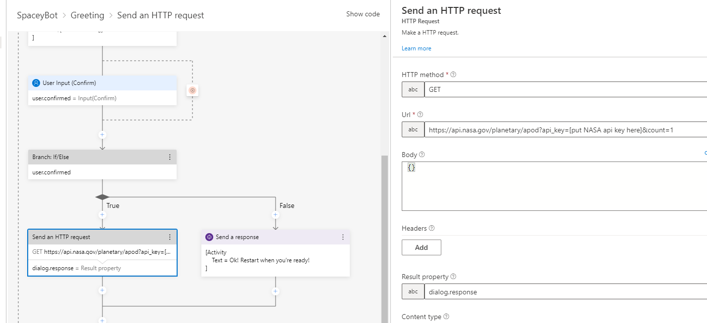

# SpaceyBot

A bot built with the Bot Framework Composer

## What it does

Prompts the user and displays a random image from NASA's [Astronomy Picture of the Day](https://github.com/nasa/apod-api) open API.

## Instructions

1. Install the [Bot Framework Composer](https://docs.microsoft.com/en-us/composer/install-composer)
1. Clone/download this repo.
1. Open the Bot Framework Composer, select "Open" and open the folder you cloned/downloaded.
1. Go to the [NASA API Site](https://api.nasa.gov/) and fill out the form to receive an API key to your email.
1. Replace the api key placeholder with the NASA api key that has been generated for you.
    - 

1. Select "Start Bot" at the top right of the composer. You can use the web chat, or install and use the Bot Emulator to test it.
    -  

## Exporting to C# or JavaScript

1. Go to "Project Settings" on the right side of the Bot Framework Composer
1. Scroll down to "Custom runtime"
1. Switch "Use custom runtime" on
1. Select "Get a new copy of the runtime code"
1. Select C# or JS
    -  
1. The code is now in the directory named "runtime" in the bot directory.
    -  

## Read more

- [Bot Framework Composer Documentation](https://docs.microsoft.com/composer/)
- Microsoft Learn: [Create conversational AI Solutions](https://docs.microsoft.com/learn/paths/create-conversational-ai-solutions/)